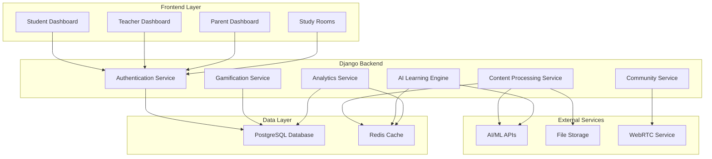

# Design Document

## Overview

Metlab.edu is designed as a modern web application using Django as the backend framework with PostgreSQL for data persistence, HTML/JavaScript/TailwindCSS for the frontend, and integrated AI services for content processing and adaptive learning. The architecture follows a modular approach with clear separation between AI processing, user management, content delivery, and analytics.

## Architecture

### High-Level Architecture



### Technology Stack Enhancements

**Backend:**
- Django 4.2+ with Django REST Framework for API endpoints
- Celery with Redis for asynchronous AI processing tasks
- Django Channels for real-time features (study rooms, notifications)
- PostgreSQL with full-text search capabilities

**Frontend:**
- Vanilla JavaScript with modern ES6+ features
- TailwindCSS for responsive design
- Chart.js for analytics visualization
- WebRTC for video chat functionality

**AI/ML Integration:**
- OpenAI API or similar for content analysis and generation
- Hugging Face Transformers for local NLP processing
- scikit-learn for learning analytics and recommendations

## Components and Interfaces

### 1. User Management System

**Models:**
```python
# Core user models
class User(AbstractUser):
    role = models.CharField(choices=ROLE_CHOICES)
    created_at = models.DateTimeField(auto_now_add=True)

class StudentProfile(models.Model):
    user = models.OneToOneField(User)
    learning_preferences = models.JSONField()
    current_streak = models.IntegerField(default=0)
    total_xp = models.IntegerField(default=0)

class TeacherProfile(models.Model):
    user = models.OneToOneField(User)
    subjects = models.ManyToManyField('Subject')
    institution = models.CharField(max_length=200)

class ParentProfile(models.Model):
    user = models.OneToOneField(User)
    children = models.ManyToManyField(StudentProfile)
```

**Key Interfaces:**
- Authentication API endpoints
- Role-based dashboard routing
- Account linking for parent-child relationships

### 2. Content Processing Engine

**Models:**
```python
class UploadedContent(models.Model):
    user = models.ForeignKey(User)
    file = models.FileField(upload_to='uploads/')
    content_type = models.CharField(max_length=50)
    processed = models.BooleanField(default=False)
    key_concepts = models.JSONField(null=True)

class GeneratedSummary(models.Model):
    content = models.ForeignKey(UploadedContent)
    summary_type = models.CharField(choices=SUMMARY_TYPES)
    text = models.TextField()

class GeneratedQuiz(models.Model):
    content = models.ForeignKey(UploadedContent)
    questions = models.JSONField()
    difficulty_level = models.CharField(max_length=20)

class Flashcard(models.Model):
    content = models.ForeignKey(UploadedContent)
    front_text = models.TextField()
    back_text = models.TextField()
    concept_tag = models.CharField(max_length=100)
```

**Processing Pipeline:**
1. File upload and validation
2. Content extraction (PDF parsing, OCR if needed)
3. AI-powered concept identification
4. Parallel generation of summaries, quizzes, and flashcards
5. Quality validation and storage

### 3. AI Learning Engine

**Models:**
```python
class LearningSession(models.Model):
    student = models.ForeignKey(StudentProfile)
    content = models.ForeignKey(UploadedContent)
    start_time = models.DateTimeField()
    end_time = models.DateTimeField(null=True)
    performance_score = models.FloatField(null=True)

class WeaknessAnalysis(models.Model):
    student = models.ForeignKey(StudentProfile)
    subject = models.CharField(max_length=100)
    concept = models.CharField(max_length=200)
    weakness_score = models.FloatField()
    last_updated = models.DateTimeField(auto_now=True)

class PersonalizedRecommendation(models.Model):
    student = models.ForeignKey(StudentProfile)
    recommendation_type = models.CharField(max_length=50)
    content = models.JSONField()
    priority = models.IntegerField()
    created_at = models.DateTimeField(auto_now_add=True)
```

**Adaptive Learning Algorithm:**
- Performance tracking across subjects and concepts
- Machine learning model for weakness identification
- Personalized content recommendation engine
- Dynamic difficulty adjustment

### 4. Gamification System

**Models:**
```python
class Achievement(models.Model):
    name = models.CharField(max_length=100)
    description = models.TextField()
    badge_icon = models.CharField(max_length=50)
    xp_requirement = models.IntegerField()

class StudentAchievement(models.Model):
    student = models.ForeignKey(StudentProfile)
    achievement = models.ForeignKey(Achievement)
    earned_at = models.DateTimeField(auto_now_add=True)

class Leaderboard(models.Model):
    student = models.ForeignKey(StudentProfile)
    subject = models.CharField(max_length=100)
    weekly_xp = models.IntegerField()
    monthly_xp = models.IntegerField()
    rank = models.IntegerField()

class VirtualCurrency(models.Model):
    student = models.ForeignKey(StudentProfile)
    coins = models.IntegerField(default=0)
    earned_today = models.IntegerField(default=0)
    last_updated = models.DateField(auto_now=True)
```

### 5. Community and Tutoring System

**Models:**
```python
class TutorProfile(models.Model):
    user = models.OneToOneField(User)
    subjects = models.ManyToManyField('Subject')
    rating = models.FloatField(default=0.0)
    hourly_rate = models.DecimalField(max_digits=6, decimal_places=2)

class StudyGroup(models.Model):
    name = models.CharField(max_length=100)
    subject = models.CharField(max_length=100)
    members = models.ManyToManyField(StudentProfile)
    created_by = models.ForeignKey(StudentProfile, related_name='created_groups')
    max_members = models.IntegerField(default=6)

class StudySession(models.Model):
    group = models.ForeignKey(StudyGroup)
    scheduled_time = models.DateTimeField()
    duration_minutes = models.IntegerField()
    room_id = models.CharField(max_length=100, unique=True)
    status = models.CharField(max_length=20, default='scheduled')
```

## Data Models

### Database Schema Design

**Core Entities:**
- Users (with role-based profiles)
- Content (uploaded files and generated materials)
- Learning Sessions and Performance Data
- Gamification Elements (achievements, leaderboards)
- Community Features (groups, tutoring)

**Relationships:**
- One-to-Many: User → Content, Student → Learning Sessions
- Many-to-Many: Students ↔ Study Groups, Teachers ↔ Subjects
- Hierarchical: Parent → Children (Students)

**Indexing Strategy:**
- Primary keys and foreign keys
- Composite indexes on (student_id, subject, date) for performance queries
- Full-text search indexes on content and concepts
- Partial indexes for active sessions and recent activities

## Error Handling

### Error Categories and Responses

**File Processing Errors:**
- Invalid file formats → User-friendly error with supported formats
- File size limits → Clear messaging with upgrade options
- AI processing failures → Graceful degradation with manual alternatives

**Authentication and Authorization:**
- Invalid credentials → Secure error messages without user enumeration
- Insufficient permissions → Redirect to appropriate dashboard
- Session expiration → Automatic refresh with user notification

**AI Service Failures:**
- API rate limits → Queue requests with user notification
- Service unavailability → Fallback to cached content or manual mode
- Processing timeouts → Background processing with email notification

**Real-time Communication:**
- WebRTC connection failures → Fallback to text chat
- Network interruptions → Automatic reconnection with state preservation
- Browser compatibility → Progressive enhancement approach

### Monitoring and Logging

- Structured logging with correlation IDs
- Performance monitoring for AI processing times
- User activity analytics for feature usage
- Error tracking with automated alerting

## Testing Strategy

### Unit Testing
- Django model validation and business logic
- AI processing pipeline components
- Gamification calculation algorithms
- User authentication and authorization

### Integration Testing
- API endpoint functionality
- Database transaction integrity
- External AI service integration
- File upload and processing workflows

### End-to-End Testing
- Complete user journeys (student, teacher, parent)
- Cross-browser compatibility
- Mobile responsiveness
- Real-time features (study rooms, notifications)

### Performance Testing
- Load testing for concurrent users
- AI processing performance benchmarks
- Database query optimization validation
- Frontend rendering performance

### Security Testing
- Authentication and session management
- File upload security (malware scanning)
- Data privacy compliance (GDPR/COPPA)
- API security and rate limiting

The design emphasizes scalability, maintainability, and user experience while leveraging modern web technologies and AI capabilities to create an engaging learning platform.