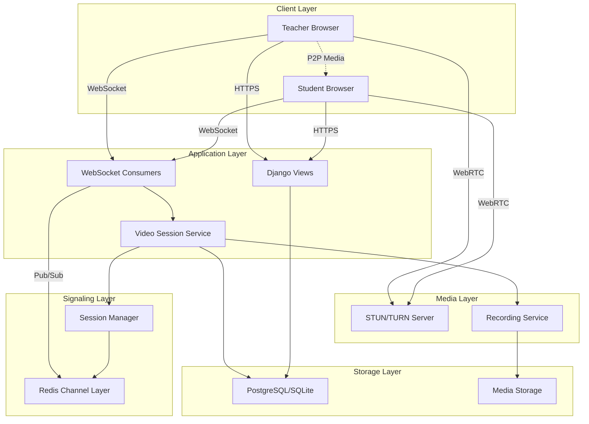

# Video Chat System Design Document

## Overview

The video chat system will enable real-time video communication between teachers and students using WebRTC technology. The system will integrate with the existing MetLab Education platform, leveraging Django Channels for WebSocket communication and Redis for signaling. The design focuses on scalability, reliability, and ease of use while maintaining security and privacy standards.

### Key Features

- One-on-one video calls between teachers and students
- Group video sessions for class-wide instruction
- Screen sharing capabilities for teachers
- Session scheduling and calendar integration
- Session recording and playback
- Network quality adaptation
- Parent monitoring and session history
- Integration with existing class and tutoring systems

## Architecture

### High-Level Architecture



### Technology Stack

- **Frontend**: Vanilla JavaScript with WebRTC API
- **Backend**: Django 5.2+ with Django Channels
- **WebSocket**: Django Channels with Redis backend
- **Signaling**: Redis Pub/Sub
- **Media Streaming**: WebRTC (peer-to-peer)
- **STUN/TURN**: Coturn or cloud service (Twilio, Agora)
- **Recording**: MediaRecorder API + server-side processing
- **Storage**: Django media storage for recordings

## Components and Interfaces

### 1. Database Models

#### VideoSession Model

```python
class VideoSession(models.Model):
    """Model for video chat sessions"""
    
    SESSION_TYPE_CHOICES = [
        ('one_on_one', 'One-on-One'),
        ('group', 'Group Session'),
        ('class', 'Class Session'),
    ]
    
    STATUS_CHOICES = [
        ('scheduled', 'Scheduled'),
        ('active', 'Active'),
        ('completed', 'Completed'),
        ('cancelled', 'Cancelled'),
    ]
    
    session_id = models.UUIDField(unique=True, default=uuid.uuid4)
    session_type = models.CharField(max_length=20, choices=SESSION_TYPE_CHOICES)
    host = models.ForeignKey(User, on_delete=models.CASCADE, related_name='hosted_video_sessions')
    title = models.CharField(max_length=200)
    description = models.TextField(blank=True)
    scheduled_time = models.DateTimeField(null=True, blank=True)
    started_at = models.DateTimeField(null=True, blank=True)
    ended_at = models.DateTimeField(null=True, blank=True)
    duration_minutes = models.IntegerField(default=60)
    status = models.CharField(max_length=20, choices=STATUS_CHOICES, default='scheduled')
    
    # Relationships
    teacher_class = models.ForeignKey('learning.TeacherClass', null=True, blank=True, on_delete=models.SET_NULL)
    tutor_booking = models.OneToOneField('community.TutorBooking', null=True, blank=True, on_delete=models.SET_NULL)
    
    # Recording
    is_recorded = models.BooleanField(default=False)
    recording_url = models.URLField(blank=True)
    recording_size_bytes = models.BigIntegerField(null=True, blank=True)
    
    # Settings
    max_participants = models.IntegerField(default=30)
    allow_screen_share = models.BooleanField(default=True)
    require_approval = models.BooleanField(default=False)
    
    created_at = models.DateTimeField(auto_now_add=True)
    updated_at = models.DateTimeField(auto_now=True)
```

#### VideoSessionParticipant Model

```python
class VideoSessionParticipant(models.Model):
    """Model for tracking participants in video sessions"""
    
    ROLE_CHOICES = [
        ('host', 'Host'),
        ('participant', 'Participant'),
    ]
    
    STATUS_CHOICES = [
        ('invited', 'Invited'),
        ('joined', 'Joined'),
        ('left', 'Left'),
        ('removed', 'Removed'),
    ]
    
    session = models.ForeignKey(VideoSession, on_delete=models.CASCADE, related_name='participants')
    user = models.ForeignKey(User, on_delete=models.CASCADE)
    role = models.CharField(max_length=20, choices=ROLE_CHOICES, default='participant')
    status = models.CharField(max_length=20, choices=STATUS_CHOICES, default='invited')
    
    joined_at = models.DateTimeField(null=True, blank=True)
    left_at = models.DateTimeField(null=True, blank=True)
    
    # Media state
    audio_enabled = models.BooleanField(default=True)
    video_enabled = models.BooleanField(default=True)
    screen_sharing = models.BooleanField(default=False)
    
    # Connection quality
    connection_quality = models.CharField(max_length=20, default='unknown')
    
    created_at = models.DateTimeField(auto_now_add=True)
    updated_at = models.DateTimeField(auto_now=True)
```

#### VideoSessionEvent Model

```python
class VideoSessionEvent(models.Model):
    """Model for logging events during video sessions"""
    
    EVENT_TYPE_CHOICES = [
        ('session_started', 'Session Started'),
        ('session_ended', 'Session Ended'),
        ('participant_joined', 'Participant Joined'),
        ('participant_left', 'Participant Left'),
        ('screen_share_started', 'Screen Share Started'),
        ('screen_share_stopped', 'Screen Share Stopped'),
        ('recording_started', 'Recording Started'),
        ('recording_stopped', 'Recording Stopped'),
        ('connection_issue', 'Connection Issue'),
    ]
    
    session = models.ForeignKey(VideoSession, on_delete=models.CASCADE, related_name='events')
    event_type = models.CharField(max_length=30, choices=EVENT_TYPE_CHOICES)
    user = models.ForeignKey(User, on_delete=models.CASCADE, null=True, blank=True)
    details = models.JSONField(default=dict)
    timestamp = models.DateTimeField(auto_now_add=True)
```

### 2. WebSocket Consumer

#### VideoSessionConsumer

Handles WebSocket connections for video sessions, managing signaling for WebRTC connections.

**Key Responsibilities:**
- Accept/reject WebSocket connections based on authentication
- Handle WebRTC signaling (offer, answer, ICE candidates)
- Broadcast participant state changes
- Manage session lifecycle events
- Handle screen sharing coordination

**Message Types:**
- `join_session`: User joins a video session
- `leave_session`: User leaves a video session
- `webrtc_offer`: WebRTC offer from peer
- `webrtc_answer`: WebRTC answer from peer
- `ice_candidate`: ICE candidate exchange
- `media_state_change`: Audio/video enable/disable
- `screen_share_start`: Start screen sharing
- `screen_share_stop`: Stop screen sharing
- `chat_message`: Text chat during session

### 3. Video Session Service

#### VideoSessionService Class

Business logic layer for managing video sessions.

**Key Methods:**
- `create_session(host, session_type, **kwargs)`: Create a new video session
- `schedule_session(session_id, scheduled_time)`: Schedule a session
- `start_session(session_id, user)`: Start a video session
- `end_session(session_id, user)`: End a video session
- `join_session(session_id, user)`: Add participant to session
- `leave_session(session_id, user)`: Remove participant from session
- `get_session_participants(session_id)`: Get all participants
- `update_participant_media_state(session_id, user, audio, video)`: Update media state
- `start_recording(session_id)`: Start session recording
- `stop_recording(session_id)`: Stop session recording
- `get_session_history(user)`: Get user's session history

### 4. Frontend Components

#### VideoCallInterface

Main JavaScript component for video call UI.

**Features:**
- Video grid layout (responsive for 1-30 participants)
- Local and remote video streams
- Audio/video controls
- Screen sharing controls
- Participant list
- Connection quality indicators
- Chat sidebar

**Key Functions:**
- `initializeWebRTC()`: Initialize WebRTC peer connections
- `connectWebSocket()`: Establish WebSocket connection
- `handleOffer(offer)`: Handle incoming WebRTC offer
- `handleAnswer(answer)`: Handle incoming WebRTC answer
- `handleICECandidate(candidate)`: Handle ICE candidate
- `toggleAudio()`: Mute/unmute microphone
- `toggleVideo()`: Enable/disable camera
- `startScreenShare()`: Start screen sharing
- `stopScreenShare()`: Stop screen sharing
- `leaveSession()`: Leave the video session

### 5. STUN/TURN Configuration

For development and small deployments, use public STUN servers. For production, deploy a TURN server (Coturn) or use a cloud service.

**Configuration:**
```javascript
const iceServers = [
    { urls: 'stun:stun.l.google.com:19302' },
    { urls: 'stun:stun1.l.google.com:19302' },
    {
        urls: 'turn:turn.example.com:3478',
        username: 'username',
        credential: 'password'
    }
];
```

### 6. Recording Service

#### RecordingService Class

Handles session recording and storage.

**Key Methods:**
- `start_recording(session_id)`: Initialize recording
- `stop_recording(session_id)`: Finalize and save recording
- `process_recording(session_id)`: Process raw recording data
- `get_recording_url(session_id)`: Get playback URL
- `delete_recording(session_id)`: Delete recording

**Recording Strategy:**
- Client-side: Use MediaRecorder API to capture streams
- Server-side: Receive chunks via WebSocket and assemble
- Storage: Save to Django media storage or cloud storage (S3)
- Format: WebM or MP4 for broad compatibility

## Data Models

### VideoSession
- `session_id`: UUID (unique identifier)
- `session_type`: one_on_one | group | class
- `host`: ForeignKey to User
- `title`: CharField
- `description`: TextField
- `scheduled_time`: DateTimeField
- `started_at`: DateTimeField
- `ended_at`: DateTimeField
- `duration_minutes`: IntegerField
- `status`: scheduled | active | completed | cancelled
- `teacher_class`: ForeignKey to TeacherClass (optional)
- `tutor_booking`: OneToOneField to TutorBooking (optional)
- `is_recorded`: BooleanField
- `recording_url`: URLField
- `max_participants`: IntegerField
- `allow_screen_share`: BooleanField

### VideoSessionParticipant
- `session`: ForeignKey to VideoSession
- `user`: ForeignKey to User
- `role`: host | participant
- `status`: invited | joined | left | removed
- `joined_at`: DateTimeField
- `left_at`: DateTimeField
- `audio_enabled`: BooleanField
- `video_enabled`: BooleanField
- `screen_sharing`: BooleanField
- `connection_quality`: CharField

### VideoSessionEvent
- `session`: ForeignKey to VideoSession
- `event_type`: session_started | participant_joined | etc.
- `user`: ForeignKey to User
- `details`: JSONField
- `timestamp`: DateTimeField

## Error Handling

### Connection Errors

1. **WebSocket Connection Failure**
   - Retry connection with exponential backoff
   - Display user-friendly error message
   - Fallback to polling if WebSocket unavailable

2. **WebRTC Connection Failure**
   - Attempt ICE restart
   - Try different TURN servers
   - Suggest audio-only mode
   - Provide troubleshooting tips

3. **Media Device Errors**
   - Check permissions
   - Detect missing devices
   - Provide clear instructions to user

### Session Errors

1. **Session Full**
   - Check max_participants before allowing join
   - Display waiting room or rejection message

2. **Session Ended**
   - Gracefully disconnect all participants
   - Save session data and recordings
   - Redirect to session summary page

3. **Permission Denied**
   - Verify user has access to session
   - Check teacher-student relationships
   - Enforce parent consent for minors

### Recording Errors

1. **Recording Failure**
   - Log error details
   - Notify host of failure
   - Continue session without recording

2. **Storage Failure**
   - Retry upload with backoff
   - Store locally temporarily
   - Alert administrator

## Testing Strategy

### Unit Tests

1. **Model Tests**
   - VideoSession creation and state transitions
   - VideoSessionParticipant join/leave logic
   - Event logging accuracy

2. **Service Tests**
   - Session lifecycle management
   - Participant management
   - Recording service operations

3. **Consumer Tests**
   - WebSocket message handling
   - Signaling message routing
   - Authentication and authorization

### Integration Tests

1. **End-to-End Session Flow**
   - Create session → Join → Media exchange → Leave
   - Screen sharing workflow
   - Recording workflow

2. **Multi-Participant Tests**
   - Multiple users joining simultaneously
   - Participant limit enforcement
   - Broadcast message delivery

3. **Network Condition Tests**
   - Simulated packet loss
   - Bandwidth constraints
   - Connection interruption and recovery

### Manual Testing

1. **Cross-Browser Compatibility**
   - Chrome, Firefox, Safari, Edge
   - Mobile browsers (iOS Safari, Chrome Mobile)

2. **Device Testing**
   - Different camera/microphone combinations
   - Screen sharing on different OS
   - Mobile device video calls

3. **User Experience Testing**
   - UI responsiveness
   - Audio/video quality
   - Latency and synchronization

## Security Considerations

### Authentication & Authorization

- Verify user authentication before allowing WebSocket connection
- Check user role and permissions for session access
- Validate teacher-student relationships for one-on-one calls
- Enforce parent consent for students under 13

### Data Privacy

- Encrypt WebSocket connections (WSS)
- Use DTLS-SRTP for WebRTC media encryption
- Store recordings with access controls
- Log session events for audit trail
- Comply with COPPA and GDPR requirements

### Rate Limiting

- Limit session creation per user per hour
- Throttle WebSocket message frequency
- Prevent spam in chat messages

### Content Moderation

- Allow reporting of inappropriate behavior
- Enable session recording for safety
- Provide parent monitoring capabilities
- Implement emergency session termination

## Performance Optimization

### Scalability

- Use Redis for WebSocket message routing
- Implement connection pooling
- Optimize database queries with select_related/prefetch_related
- Cache session data in Redis

### Media Quality

- Adaptive bitrate based on network conditions
- Automatic resolution adjustment
- Audio-only fallback for poor connections
- Simulcast for group sessions (future enhancement)

### Frontend Optimization

- Lazy load video streams
- Optimize video grid layout
- Minimize DOM updates
- Use Web Workers for heavy processing

## Integration Points

### Existing Systems

1. **Learning Module**
   - Link video sessions to TeacherClass
   - Schedule sessions from class management
   - Record attendance automatically

2. **Community Module**
   - Integrate with TutorBooking
   - Enable video for study sessions
   - Link to StudySession model

3. **Accounts Module**
   - Use existing User and profile models
   - Respect parent monitoring settings
   - Log video session activity

4. **Gamification Module**
   - Award XP for session participation
   - Create achievements for video milestones
   - Track engagement metrics

## Deployment Considerations

### Infrastructure Requirements

- WebSocket support (Django Channels + Redis)
- TURN server for NAT traversal (Coturn or cloud service)
- Media storage for recordings (local or S3)
- Sufficient bandwidth for video streaming

### Configuration

- STUN/TURN server URLs and credentials
- Maximum participants per session
- Recording quality settings
- Storage backend configuration

### Monitoring

- Track active sessions
- Monitor WebSocket connections
- Alert on high error rates
- Log session quality metrics

## Future Enhancements

1. **Advanced Features**
   - Virtual backgrounds
   - Breakout rooms for group sessions
   - Whiteboard collaboration
   - Live polls and quizzes during sessions

2. **AI Integration**
   - Automatic transcription
   - Real-time translation
   - Engagement analytics
   - Automated highlights

3. **Mobile Apps**
   - Native iOS and Android apps
   - Better mobile performance
   - Push notifications for calls

4. **Analytics**
   - Session quality reports
   - Engagement metrics
   - Usage patterns
   - Performance insights
